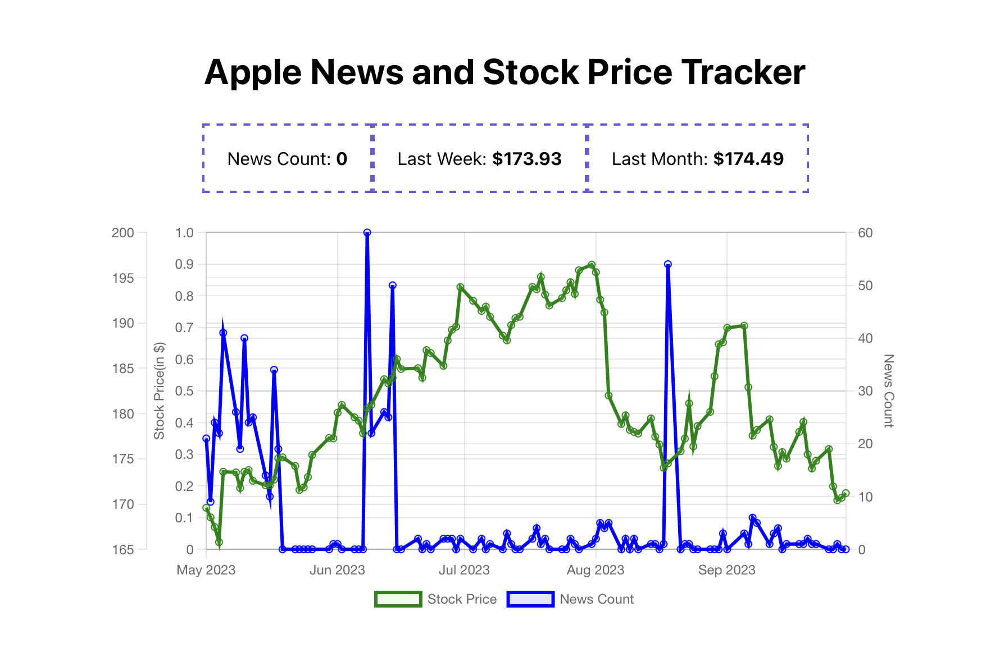

## About

Hi, I'm Zarif! I have a technical background and hold a Master of Science (M.S.) degree in Micro data analysis from Dalarna University, with a major in Business Intelliegence. I have 5 years of experience in the field of information technology, where I held roles such as Data Analyst/BI specialist, Head of Department, and CTO in a technological startup. After a year of transitioning from software engineer to Data Analysis, I am currently a Data Analyst at a E-commerce company Tech Diversity, starting from Mar 2022.
 
My CV in [pdf](https://github.com/zarifshawon/Portfolio/blob/main/Zarif-Mahmud.pdf) 

 
This repository serves to showcase my skills and as a platform to share my projects, and a way to track my progress in Data Analytics and Data Science-related topics.  
 
  

## Table of contents
- [About](#about)
- [Skills](#skills)
- [Portfolio Projects](#portfolio-projects)
	+ [Apple News and Stock Price Tracker](#apple-news-and-stock-price-tracker)
- [Certificates](#certificates)
- [Contacts](#contacts)
  
## Skills
● Data Analysis and visualization  
● Statistical analysis   
● Microsoft Power BI, Tableau   
● Python, R, SQL (Programming Language)   
● Machine Learning   
● Jira   
● Microsoft Excel   
● Data Modelling   

## Portfolio Projects
In this section I will list data analytics projects briefly describing the technology stack used to solve cases.

### Apple News and Stock Price Tracker
**Code:** [`apple_news_app_tracker`](https://github.com/zarifshawon/Apple-News-and-Stock-Price-Tracker)    
**Description:** The Apple News and Stock Price Tracker is a web-based application designed to provide users with insights into Apple-related news articles and stock prices over time. This report outlines the development process, key features, and challenges faced during the project.  
**Skills:** data cleaning(structured and unstructured data), data analysis, web application development,and data visualization.  
**Technology:** Node.js, React.js, Chart.js.  
**Results:** Review of Apple-related news articles and stock prices over time. 

### Tableau Vizzes
**Description:** My Tableau Public account ---> [go to Tableau..]()  
 

## Certificates
I believe that the best way to showcase skills is by doing and sharing your job done but sometimes certificates appear to be as an indirect result:) So here is a list of the ones I have (in reverse-chronological order, with the date of completion in brackets):
- [SAP ERP Essential Training](https://www.linkedin.com/learning/certificates/63b18a90c9c5487b8b5c8ee9852857566468494504645e6cd2b9c35c277d2902) (Feb 2024) (LinkedIn Learning)
- [SQL for Data Analysis](https://www.linkedin.com/learning/certificates/434f25173e514ca041ec4638f810980f6d314138b680c56e6820afb618108eb0) (Jan 2024) (LinkedIn Learning)
- [Microsoft Project for the Web: Reporting with Power BI](https://www.linkedin.com/learning/certificates/dcb29e9ba88221f279bcff4fde0daf5d9f112f31429f9a20fbc8154fc2c6b9d5) (Dec 2023) (LinkedIn Learning)

## Contacts
- LinkedIn: [@znmzarifmahmud](https://www.linkedin.com/in/znmzarifmahmud/)
- E-mail: znmzarif@gmail.com
